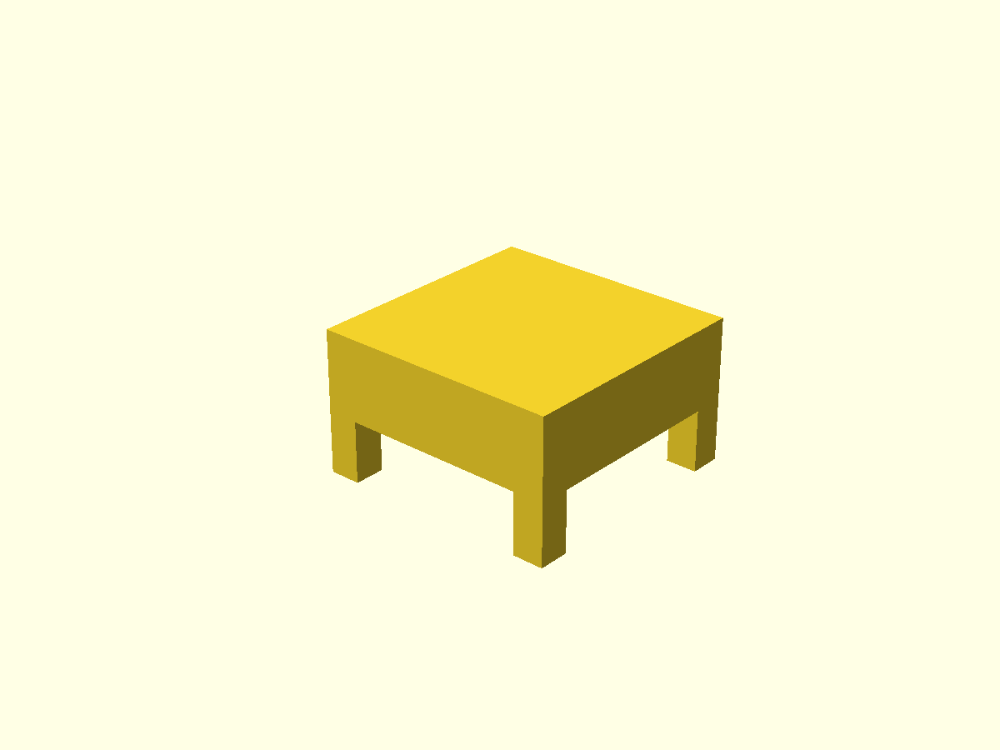

# SV08 Max 3D Printer Table

A modular, printable table designed specifically for the Sovol SV08 Max 3D printer. This table provides a sturdy platform at desk height with 2-inch clearance on all sides, optimized for belt printer manufacturing.

## Overview

The SV08 Max is a large-format 3D printer with a 500×500×500mm build volume. This table design accommodates the estimated printer footprint of 700×700×800mm with adequate clearance while positioning the print bed at comfortable desk height (~30 inches from floor).

### Completed Table Render



*The fully assembled modular table showing the complete structure with legs, rails, and table top segments*

### Table Specifications

- **Dimensions**: 802mm × 802mm × 463mm
- **Print bed height**: ~762mm (30 inches) from floor
- **Clearance**: 51mm (2 inches) on all sides around printer
- **Construction**: Modular bolt-together design
- **Material**: 3D printable components optimized for belt printers

## Components

### Structural Elements

| Component | Quantity | Dimensions (mm) | Purpose |
|-----------|----------|-----------------|---------|
| Legs | 4 | 101.6 × 101.6 × 438 | Corner posts (4×4 inch) |
| Long Rails | 4 | 599 × 80 × 30 | X-direction cross members |
| Short Rails | 4 | 80 × 599 × 30 | Y-direction cross members |
| Table Top Segments | 5 | 150 × 802 × 25 | Main table surface |
| Final Segment | 1 | 52 × 802 × 25 | Completes table width |
| Alignment Pins | 20 | 7.8 ⌀ × 15 | Table top connections |

### Component Renders

#### Structural Components

| **Leg** | **Long Rail** | **Short Rail** |
|---------|---------------|----------------|
|  |  |  |
| 4×4 inch corner post with mounting holes | X-direction cross member with bolt holes | Y-direction cross member with bolt holes |

#### Table Top Components

| **Table Top Segment** | **Final Segment** | **Alignment Pin** |
|-----------------------|-------------------|-------------------|
|  |  |  |
| Standard 150mm wide segment | 52mm wide final segment | 7.8mm diameter connection pin |

### Rail Configuration

Rails are positioned at three heights for maximum stability:
- **Bottom rails**: 200mm from ground
- **Mid-level rails**: 250mm from ground
- **Top rails**: Just below table surface

## Files Structure

```
sovolmaxtable/
├── README.md                    # This file
├── dimensions.scad              # Shared parameters
├── leg.scad                     # Leg component
├── long_rail.scad              # X-direction rail
├── short_rail.scad             # Y-direction rail
├── table_top_segment.scad      # Standard table segment
├── table_top_final_segment.scad # Final narrow segment
├── alignment_pin.scad          # Connection pins
├── compile_stls.sh             # Bash compilation script
├── Makefile                    # Make-based compilation
├── sv08_max_table_printable.scad # Original complete design
├── renders/                     # Generated component renders
│   ├── complete_table.png       # Assembled table view
│   ├── leg.png                  # Leg component
│   ├── long_rail.png           # Long rail component
│   ├── short_rail.png          # Short rail component
│   ├── table_top_segment.png   # Table segment
│   ├── table_top_final_segment.png # Final segment
│   └── alignment_pin.png       # Alignment pin
└── stl_files/                  # Generated STL files
```

## Building the STL Files

### Option 1: Using Make (Recommended)

```bash
# Compile all STL files
make all

# Clean generated files
make clean

# Show build information
make info
```

### Option 2: Using Bash Script

```bash
# Make script executable (first time only)
chmod +x compile_stls.sh

# Compile all components
./compile_stls.sh
```

Both methods will create STL files in the `stl_files/` directory.

## Belt Printer Optimization

All components are designed within typical belt printer constraints:
- **Maximum width**: 200mm (cross-belt direction)
- **Maximum height**: 200mm
- **Length**: Unlimited (belt direction)

### Print Layout

- **Legs**: Individual posts, print upright
- **Rails**: Long components utilize belt printer's unlimited length
- **Table segments**: 150mm width fits belt printer constraints
- **Alignment pins**: Small components, can be batched

## Assembly Instructions

### Hardware Required

- **M8 bolts and nuts**: For rail-to-leg connections
- **Wood glue** (optional): For permanent alignment pin installation
- **Basic tools**: Hex keys, wrenches for M8 hardware

### Assembly Steps

1. **Prepare components**: Print all required quantities
2. **Install bottom rails**: Connect rails to legs at 200mm height
3. **Install mid-level rails**: Add second level at 250mm height
4. **Install top rails**: Final rail level just below table surface
5. **Assemble table top**: Use alignment pins to connect segments
6. **Final assembly**: Secure table top to leg assembly

### Connection System

- **Rail connections**: M8 bolts through pre-drilled holes with counterbores for bolt heads
- **Table top**: Alignment pins provide seamless connections between segments
- **Leg mounting**: Dedicated holes in corner segments for leg attachment

## Design Features

### Structural Integrity

- **4×4 inch corner posts**: Robust support for heavy printer
- **Triple rail system**: Multiple levels of cross-bracing
- **Bolt connections**: Secure, removable assembly system

### Manufacturing Efficiency

- **Modular design**: Components can be printed independently
- **Belt printer optimized**: Takes advantage of unlimited length capability
- **Minimal support**: Components designed for support-free printing

### User Benefits

- **Desk height operation**: Comfortable access to printer
- **Adequate clearance**: Space for printer cooling and access
- **Expandable design**: Easy to modify or extend
- **Transportable**: Can be disassembled for moving

## Technical Notes

### SV08 Max Specifications

Based on research of the Sovol SV08 Max:
- **Build volume**: 500×500×500mm (500×500×450mm with enclosure)
- **Estimated footprint**: ~700×700×800mm (including frame and electronics)
- **Print speeds**: Up to 700mm/s
- **Bed temperature**: Up to 100°C
- **Weight**: Substantial (requires sturdy table)

### Design Calculations

- **Table clearance**: 51mm (2 inches) on all sides
- **Total table area**: 802×802mm accommodates 700×700mm printer footprint
- **Height calculation**: 463mm table + ~300mm printer = ~762mm bed height
- **Load distribution**: Multiple rail levels distribute printer weight

## Customization

### Modifying Dimensions

Edit `dimensions.scad` to adjust:
- Table size (width, depth, height)
- Component dimensions (rail thickness, leg size)
- Hardware specifications (bolt sizes, hole diameters)

### Adding Components

The modular design allows for additional features:
- Storage shelves between rails
- Cable management systems
- Printer-specific mounting brackets
- Tool storage attachments

## Support

This design is optimized for the SV08 Max but can be adapted for other large-format printers by modifying the dimensions file.

### Print Settings Recommendations

- **Layer height**: 0.2-0.3mm for structural components
- **Infill**: 20-40% for good strength-to-weight ratio
- **Perimeters**: 3-4 walls for structural integrity
- **Support**: Minimal support required due to design orientation

### Quality Considerations

- Ensure dimensional accuracy for proper bolt hole alignment
- Check first layer adhesion for long rail components
- Consider printing alignment pins at higher resolution for better fit

---

**Generated with Claude Code** - A modular, printable solution for SV08 Max 3D printer support.